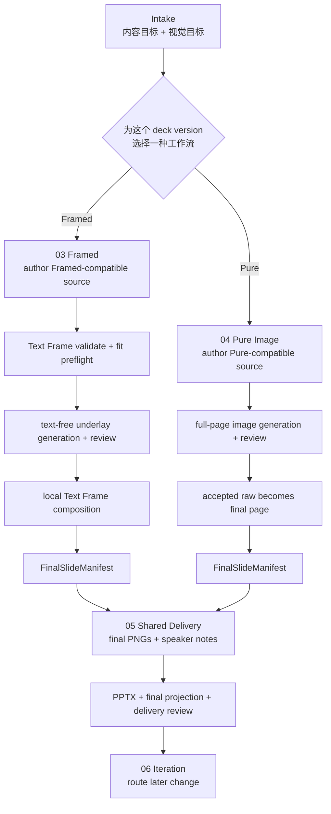

# Plan: Framed / Pure Workflow Separation and Delivery SSOT

> 类型: 设计 | 更新: 2026-07-28 | 状态: 目标已对齐，待 OpenSpec change，未实施

## 阅读说明 / 本文自足边界

这是一个 framework repository maintenance 的**工作流与目录所有权设计计划**，不是
立即执行的文件移动清单。它取代“把 Framed 作为 `04-image-production` 前后两个 hook”
的旧设想，锁定新的上层模型：

- 对用户和 Agent，`03-framed-image` 与 `04-pure-image` 是两条完整、互斥的兄弟工作流；
- 一个新 deck version 只选择一次工作流，之后只沿该工作流前进；
- 两条工作流可以在实现下层复用 provider、authorization、raw evidence、review 等
  机械能力，但这些复用不得成为用户需要理解的交叉流程；
- 两条工作流都先产出同一种 final PNG manifest，随后才进入共享的 PPTX image
  assembly、speaker notes injection 和 delivery review。

因此，本计划同时解决两类 SSOT：

1. **用户工作流 SSOT**：一个 version 的工作流选择有一个 canonical source/receipt，
   不靠聊天记忆，也不在每页重新选择；
2. **实现所有权 SSOT**：Framed、Pure 和 Delivery 各自只有一个 business owner，
   shared module 只拥有真正相同的下层机制。

目录是检索与责任入口，不是 runtime pass/fail authority。Canonical source、receipt、
evidence 和 manifest 仍是运行时 Source of Record；README 与目录树只是它们的可导航说明。

本文不读取或依赖任何 `deck_*`、`dpt_*` 或 `_generated/` 生产数据，也不授权修改
framework source、现有 run、state、receipt 或生成物。

## 当前基线与目标差异

### 当前已接受行为

当前 framework 的 accepted specs 与 runtime 是：

- 唯一 current protocol 为 `page-authority-image2-v1` / `image2-page-authority`；
- `pure-image2` / `framed-image2` 按 stable `slide_id` 逐页选择，同一 deck 可混用；
- `04-image-production` 同时拥有 shared raw lifecycle、Pure pass-through、Framed
  finalization、final manifest、PPTX、notes 和 delivery；
- Framed Text Frame 在 `02-visual-system`，Framed composition/capture 在
  `04-image-production`，source parser 与 raw builder 还各自持有部分 Framed 规则。

这些事实记录在
[`page-authority-workflow-baseline-target-gap.md`](page-authority-workflow-baseline-target-gap.md)
的 CURRENT Baseline，并由
以下当前 source 证明：

- [content-parsing spec](../../openspec/specs/content-parsing/spec.md) 接受逐页 Pure/Framed；
- [pipeline-orchestration spec](../../openspec/specs/pipeline-orchestration/spec.md) 要求 mixed
  deck 共用一条 final lineage；
- [Text Frame implementation](../../PPTMAKER_FRAMEWORK/scripts/02-visual-system/internal/page_authority_text_frame.mjs)
  拥有 `standard-v1`、fit preflight 与 reserved underlay rectangles；
- [raw profile builder](../../PPTMAKER_FRAMEWORK/scripts/04-image-production/page-authority/raw_profiles.mjs)
  和 [finalizer](../../PPTMAKER_FRAMEWORK/scripts/04-image-production/page-authority/finalizer.mjs)
  通过 authority branch 同时处理 Pure 与 Framed；
- [Framed runtime](../../PPTMAKER_FRAMEWORK/scripts/04-image-production/page-authority/internal/framed_runtime.mjs)
  与 [capture runtime](../../PPTMAKER_FRAMEWORK/scripts/04-image-production/page-authority/internal/framed_capture_runtime.mjs)
  当前仍是 `04` 的 private implementation。

### 本计划的目标行为

本计划不是对上述行为做目录包装，而是提出新的上层工作流模型：

- 新 deck version 在 intake/source authoring 时选择概念上的 `framed-image` 或
  `pure-image` workflow；这两个是本文标签，不是已锁定的 source token；
- 该选择属于整个 version，不是 per-slide default，也不是每页 override；
- active authoring 不提供 mixed workflow；
- Framed 与 Pure 各自从 source semantics 负责到 final PNG manifest；
- shared delivery 只从统一 final PNG manifest 开始，不参与 authority dispatch；
- CURRENT 的 `page-authority-image2-v1`、`pure-image2`、`framed-image2` 标识及其语义保持
  不变；TARGET 必须有可区分的新 production identity 与 source receipt schema；
- 现有 mixed current runs 如何继续或迁移，必须在 OpenSpec 中显式决定，不能静默重解释。

这意味着实施前必须先创建独立 OpenSpec change，修订 accepted specs。不得把它伪装成
“CLI 和 receipt schema 均不变”的纯 relocation。

## 已定决策与待设计项

| 状态 | 决策 |
| --- | --- |
| 已定 | `03-framed-image` 是一条完整的 Framed 用户/Agent 工作流，不是 `04` 的前后 hook。 |
| 已定 | `04-pure-image` 是一条完整的 Pure Image 用户/Agent 工作流，不负责编排 Framed。 |
| 已定 | 一个新 deck version 只选择一次 `03` 或 `04`；上层流程不做 per-slide dispatch。 |
| 已定 | 两条工作流都以统一 `FinalSlideManifest` 为终点，然后进入 shared delivery。 |
| 已定 | PPTX full-page image assembly、speaker notes injection、final projection 与 delivery review 由独立 shared delivery owner 负责。 |
| 已定 | 下层代码允许复用，但复用模块不得拥有用户工作流选择，也不得复制 Framed/Pure 业务规则。 |
| 已定 | TARGET 不原地改变 CURRENT identifier 的含义；new source marker 与 receipt schema 必须可与 `page-authority-image2-v1` CURRENT runs 确定区分。 |
| 待定 | TARGET production identity、version-level workflow selection 与 receipt schema 的最终名称；state mode 是否换名，但 source/state pair 必须无歧义。 |
| 待定 | 现有 mixed current runs 是保留 bounded compatibility route，还是只能 structural migrate 到 homogeneous vNext。 |
| 待定 | 外部 CLI 命令保持现名并按 version workflow 路由，还是增加明确的 Framed/Pure command surface。 |
| 待定 | `Header Text & Style Refresh` 的 TARGET surface 是 text-only，还是包含 versioned preset changes。 |

## 目标工作流

### 用户与 Agent 看到的模型

用户只需在 version 开始时作一次选择。之后 Agent 根据 canonical selection 进入一条
直线流程，不再让用户理解 raw builder、adapter dispatch 或共享 implementation。



`03` 与 `04` 是 sibling branches，不是 `03 -> 04` 的顺序。Workflow root README、
BOOTSTRAP、quick-start 和 playbook 必须明确画出 XOR 选择，不能仅靠一段文字解释编号。

这里的“完整 workflow”指用户从 version choice 到 final slides 始终留在一条可理解的路径，
不表示复制 `01-content` 与 `02-visual-system`。两条 workflow 都通过它们的 public
interfaces 使用 shared source grammar、stable identity、visual language 和 references；
Framed/Pure-specific semantics 仍分别只属于 `03` / `04`。

### 实现内部允许的复用

上层工作流分离不等于复制所有底层机制。推荐的数据流是：

```text
03 Framed adapter ──> RawWorkPlan ──┐
                                    ├─> shared raw mechanics
04 Pure adapter   ──> RawWorkPlan ──┘    authorization / submit / evidence / review
                                                |
                                                v
                                       AcceptedRawEvidence
                                          /           \
                              03 local compose     04 pass-through
                                          \           /
                                           FinalSlideManifest
                                                    |
                                                    v
                                      shared PPTX + notes delivery
```

复用判断不用 DRY 次数，而用 ownership：

- 如果逻辑需要知道 `standard-v1`、Text Frame literals、reserved underlay rectangles、
  no-text 语义或 local capture，它属于 `03`；
- 如果逻辑需要知道 Pure display literals、full-page raw contract 或 Pure rebuild
  semantics，它属于 `04`；
- 如果逻辑只处理 provider scope、opaque contract digest、raw bytes、accepted evidence、
  final PNG manifest、PPTX image placement 或 notes receipt，它可以共享；
- shared implementation 不得用 `if (authority === ...)` 重新拥有两条业务分支。需要差异时，
  由 `03` / `04` adapter 先产出 typed input，shared module 只消费该 interface。

这把合流点放在稳定 artifact seam，而不是把两股业务信息塞进一个 generic coordinator。

## SSOT 与 Owner Contract

### Runtime Source of Record

| Fact | 唯一 Source of Record | 禁止的替代来源 |
| --- | --- | --- |
| TARGET production identity | new versioned source marker + bound state/receipt identity | 把 `page-authority-image2-v1` 原地解释成 TARGET |
| TARGET version 选择 Framed 还是 Pure | canonical source frontmatter + resolved source receipt | chat memory、目录名、某页 artifact、默认猜测 |
| Framed contract 与 fit 结果 | `03` evaluator 产生的 typed Framed receipt/preflight evidence | `01`/`02`/shared 中的重复常量或 validator |
| Pure raw contract | `04` evaluator 产生的 typed Pure raw plan | shared raw module 中的 authority branch |
| raw authorization/evidence/review | shared raw owner 的 current receipt chain | README、copied manifest、旧 review |
| 可交付页面 | canonical `FinalSlideManifest` + bound final PNG bytes | raw filename、目录扫描、authority 推断 |
| PPTX 与 notes delivery | shared delivery receipt chain | `03`/`04` 各自发布的第二份 delivery result |

### Directory Ownership

推荐目标树：

```text
PPTMAKER_FRAMEWORK/
├── workflow/
│   ├── 00-setup/
│   ├── 01-content/
│   ├── 02-visual-system/
│   ├── 03-framed-image/      # 完整 Framed workflow
│   ├── 04-pure-image/        # 完整 Pure Image workflow
│   ├── 05-delivery/          # shared final PNG -> PPTX + notes
│   └── 06-iteration/         # refresh / rebuild / structural routing
└── scripts/
    ├── 00-setup/
    ├── 01-content/
    ├── 02-visual-system/
    ├── 03-framed-image/      # Framed business implementation + adapter
    ├── 04-pure-image/        # Pure business implementation + adapter
    ├── 05-delivery/          # authority-agnostic final delivery
    ├── 06-iteration/
    └── shared/               # narrowly named low-level mechanics only
```

| Owner | 唯一负责 | 不得负责 |
| --- | --- | --- |
| `00-setup` | 通用 local runtime、fonts、Chromium/provider readiness | 选择 Framed/Pure 或定义页面语义 |
| `01-content` | shared source grammar、stable ID、version workflow selection syntax | Text Frame geometry、Pure/Framed semantic validation |
| `02-visual-system` | shared recipe、composition、motif、reference、style-master | Text Frame preset、Framed capture、Pure raw contract |
| `03-framed-image` | Framed source semantics、frame contract/preflight、underlay contribution、local composition、Framed refresh，直到 `FinalSlideManifest` | Pure dispatch、PPTX/notes delivery |
| `04-pure-image` | Pure source semantics、full-page raw contract、raw-to-final publication、Pure rebuild，直到 `FinalSlideManifest` | Framed preflight/composition、PPTX/notes delivery |
| shared raw owner | provider authorization/submission、tuple evidence、review mechanics | workflow selection、frame/pure semantics、final composition |
| `05-delivery` | final manifest validation、final projection、PPTX full-page image assembly、notes injection、delivery review | Pure/Framed branch 或 raw regeneration |
| `06-iteration` | 按 version workflow 与变更 ownership 选择最小合法路径 | 复制 `03`/`04`/`05` 的实现 |

`workflow/` 与 `scripts/` 可以使用相同 owner vocabulary，但各自服务不同读者：workflow
解释完整用户路径，scripts 集中 implementation。两者不靠复制规则保持一致，而由
architecture contract、public interfaces 与 documentation coherence tests 证明映射。

## Public Interface 方向

实现前应锁定三个小而深的 interfaces。以下名称只是 capability sketch，不预先锁死函数名。

### Framed workflow adapter

```text
03-framed-image/index.mjs
  - resolve Framed source semantics and preflight
  - compile text-free underlay RawWorkPlan
  - produce FinalSlideManifest from AcceptedRawEvidence via local composition
  - classify/apply Framed-local refresh
```

`standard-v1`、frame geometry、fit algorithm、no-text underlay rules、HTML capture、
font/network/runtime enforcement 均只在 `03` 有实现来源。

### Pure workflow adapter

```text
04-pure-image/index.mjs
  - resolve Pure source semantics
  - compile full-page RawWorkPlan with display literals
  - publish accepted raw bytes as FinalSlideManifest
  - classify Pure display/visual changes as raw rebuild
```

Pure 不通过 `03`，`03` 也不通过 `04`。两者只依赖明确的 shared interfaces。

### Shared delivery

```text
05-delivery/index.mjs
  - validate one current FinalSlideManifest and bound PNG bytes
  - render final projection
  - assemble full-page-image PPTX
  - inject source-owned speaker notes
  - record delivery review against exact final lineage
```

Delivery 可以保留 authority/provenance 字段用于审计，但不得依据它改变 PPTX composition
或 notes behavior。对 delivery caller 来说，两种工作流的 interface 完全相同。

## Source Resolution

Version workflow selection 必须在任何 provider work 前成为 canonical fact。推荐的职责顺序是：

1. `01-content` 解析 production marker、version-level workflow selection、stable IDs 与
   shared fields；
2. source resolver 只按 version selection dispatch 一次到 `03` 或 `04` adapter；
3. selected adapter 完成该 workflow 的 semantic normalization；
4. resolver 发布一个 immutable source receipt，所有 slides 继承同一个 workflow；
5. 后续 raw、finalization、refresh 均从该 receipt 读取，不再次推断或逐页选择。

目标 source 的形状可以类似以下 mapping；占位符不是合法 bytes，最终 identifier 必须由
OpenSpec change 锁定，并且不能复用 CURRENT identifier 的既有含义：

```yaml
production:
  pipeline: <new-versioned-target-marker>
  workflow: <framed-or-pure-workflow-id>   # version-level，不是 default
```

`page-authority-image2-v1`、`pure-image2`、`framed-image2` 继续只表示 companion Baseline
文档 Part I 的 CURRENT 模型。TARGET workflow ID 的确切拼写待定，但必须由 new
marker/field/schema 明确限定，不能让同一 source/state pair 同时拥有两种解释。

新 authoring 不再接受 per-slide `PAGE AUTHORITY` override。若未来确实需要 mixed deck，
它必须作为第三个明确、独立设计的工作流重新论证，不能作为隐藏 escape hatch 留在 parser。

## 落地顺序

1. **先创建 OpenSpec change，不移动 framework 文件。**
   - 修订至少 `content-parsing`、`pipeline-orchestration`、`image-generation`、
     `visual-config` 与 `framework-charter`。
   - MD controller metadata/consumption 必须同时修订 `node-specification`；若 direct CLI、
     receipt fields、stdout/stderr 或 diagnostics 改变，再由 `cli-surface` 锁定 producer contract。
   - 锁定 new production identity、version-level workflow schema、receipt identity、现有
     mixed-run compatibility 和 CLI/controller surface。
   - Source marker 与 source receipt schema 必须 version-separate；现有 evidence 默认不得
     跨 protocol 沿用，除非 accepted migration spec 对 exact tuple 作出明确证明。

2. **先建立 artifact seams。**
   - 固定 `RawWorkPlan`、`AcceptedRawEvidence` 与 `FinalSlideManifest` 的 owner、writer、
     readers、hash binding 和 invalidation。
   - 证明 shared raw 与 shared delivery 不需要 Framed/Pure semantic branch。
   - 保持 provider authorization、raw review 和 delivery review 的现有 protected invariants。

3. **建立两条 workflow 文档。**
   - `workflow/03-framed-image/README.md` 写完整 Framed 直线路径。
   - `workflow/04-pure-image/README.md` 写完整 Pure 直线路径。
   - root README、BOOTSTRAP、quick-start、playbook 先展示一次选择，再进入对应路径。
   - 不在用户文档中解释内部复用拓扑；只展示当前事实、当前 gate 与一个 next action。

4. **建立 `03` 与 `04` workflow adapters。**
   - 将 Text Frame、Framed raw contribution、capture/composition 与 refresh 移入 `03`。
   - 将 Pure raw contract、pass-through final publication 与 rebuild semantics 收拢到 `04`。
   - 删除 shared raw builder/finalizer 中的 authority switch；shared module 改为消费 typed
     plans/evidence。
   - `03` 与 `04` 不互相 import，也不访问对方 `internal/`。

5. **建立 shared delivery owner。**
   - 将 final manifest validation/publication、final projection、PPTX assembly、notes 与
     delivery review 移入 `05-delivery`。
   - Delivery tests 用同一组 assertions 分别消费 Framed 与 Pure manifests，证明行为无分支。
   - `03` / `04` 不发布自己的 PPTX、notes receipt 或 delivery decision。

6. **迁移 iteration、controller 与 architecture metadata。**
   - 将当前 `05-iteration` 迁为 `06-iteration`，按 version workflow 路由 refresh/rebuild。
   - 更新 MD controller `method_module`、playbook nodes、workflow inspection 与 exact-path
     fixtures。
   - 更新 `framework_architecture.mjs`、root whitelist、phase sibling edges、public
     interfaces 与 `source-test-ownership-v1.json`。

7. **处理 current mixed runs，再删除旧路径。**
   - 按已接受的 compatibility/migration design 保留 bounded reader 或执行 structural
     migration；不得把 mixed source 静默当成 Framed 或 Pure。
   - 不保留无期限 compatibility re-export，也不复制旧 validator。
   - 先跑 focused ownership/architecture/document tests，再跑相关 integration tests，
     最后运行 `npm test`。

## 完成标准

- 新 deck version 的 canonical source/receipt 恰好选择一个 workflow；正常路径没有
  per-slide authority dispatch。
- TARGET source/state/receipt identity 与 CURRENT `page-authority-image2-v1` pair 可机械区分；
  parser/controller 不会把同一 bytes 在两个模型间重解释。
- Workflow root 明确显示 `03 XOR 04 -> 05 -> 06`，不会被读成 `03 -> 04`。
- `03-framed-image` 能从 Framed source semantics 独立产出 `FinalSlideManifest`，不调用
  `04-pure-image`。
- `04-pure-image` 能从 Pure source semantics 独立产出同 schema 的
  `FinalSlideManifest`，不调用 `03-framed-image`。
- `standard-v1`、fit preflight、reserved underlay rectangles、Framed capture/composition
  只有 `03` 一个实现 owner。
- Pure display payload、raw-to-final pass-through 与 Pure rebuild semantics 只有 `04`
  一个实现 owner。
- shared raw mechanics 不包含 Framed/Pure semantic branching；它只消费 typed
  `RawWorkPlan` 并发布 bound evidence。
- `05-delivery` 对 Framed/Pure 使用完全相同的 manifest validation、PNG placement、notes
  injection 和 delivery receipt path；不存在第二份 delivery result。
- architecture contract 与 tests 禁止 `03 <-> 04` imports，并证明二者只能通过 approved
  shared interfaces 与 delivery seam 协作。
- current mixed runs 有明确、测试覆盖的 compatibility 或 structural migration 路径；无
  silent fallback。
- 外部 gate 继续保护 exact authorization、raw review、final bytes、notes 与 delivery
  identity；重构不得用“流程更简单”为由放松 invariant。

## 风险 / 取舍

- **把 sibling 编号看成顺序。** `03` 与 `04` 必须在 root graph、controller metadata 和
  tests 中建模为 XOR；仅在 README 中补一句不够。
- **CURRENT/TARGET identifier 碰撞。** `page-authority-image2-v1` 与其 per-slide authority
  tokens 保留既有语义；TARGET 使用 new versioned identity，controller marker-first dispatch，
  禁止通过字段缺失、目录或 artifact 猜测模型。
- **为了代码复用再次合并上层流程。** 共享只能位于 typed artifact seam 下方；上层
  controller 不得把用户带回 per-slide dispatch。
- **两条流程复制完整性逻辑。** Authorization、raw evidence/review、manifest integrity、
  PPTX/notes delivery 应共用 owner，避免两套 truth path。
- **shared module 变成隐藏业务 owner。** 只要 shared code 需要理解 frame preset、
  no-text、display literals 或 authority-specific refresh，就应把逻辑退回 `03`/`04`。
- **Framed 选择与内容冲突。** 若 body 必须包含语义性 labels/data/text，Agent 应在 provider
  work 前给出最早的确定性诊断：重写为 Framed-compatible content，或明确切换整个 version
  到 Pure。不得私下把单页改成 Pure。
- **现行 accepted specs 与目标冲突。** 在 OpenSpec change 被接受前，当前 mixed behavior
  仍是 runtime authority；不得先改实现后补 spec。
- **旧 mixed run 被遗忘。** Compatibility 或 migration 是 implementation gate，不是
  “以后再看”的清理尾项。
- **重命名造成半迁移。** Workflow、scripts、tests、contracts、controller metadata 与
  documentation fixtures 必须在同一 change 内完成，不能长期保留两套 owner。

## 与 Policies 的关系

该目标直接采用 `openspec/policies` 的约束：

- 对小白只有一次 workflow choice；每个失败只给一个 nearest legal action；
- source/receipt/evidence/manifest 是 direct facts，Markdown 不成为第二 authority；
- source resolve、preflight、raw gate、refresh 对同一事实复用 owner evaluator，不建立
  competing validators；
- shared control 必须带来 net simplification，不能只是多一层 dispatch；
- provider authorization、identity、bytes、hashes 和 recoverability 继续 hard-stop，不能
  因两条工作流分离而新增隐式 waiver 或 fallback。

## 落地关联

本计划确认的是目标工作流与 owner model，不是 implementation authorization。下一步应先
把它转成一个独立 OpenSpec proposal/design/spec/tasks，并在其中解决：

1. version-level workflow source/receipt schema；
2. current mixed-run compatibility/migration；
3. `03` / `04` adapter 与 shared raw artifact interfaces；
4. authority-agnostic `05-delivery` contract；
5. CLI/controller compatibility 与目录迁移计划；
6. architecture、ownership、negative tests 与全量 regression validation。
