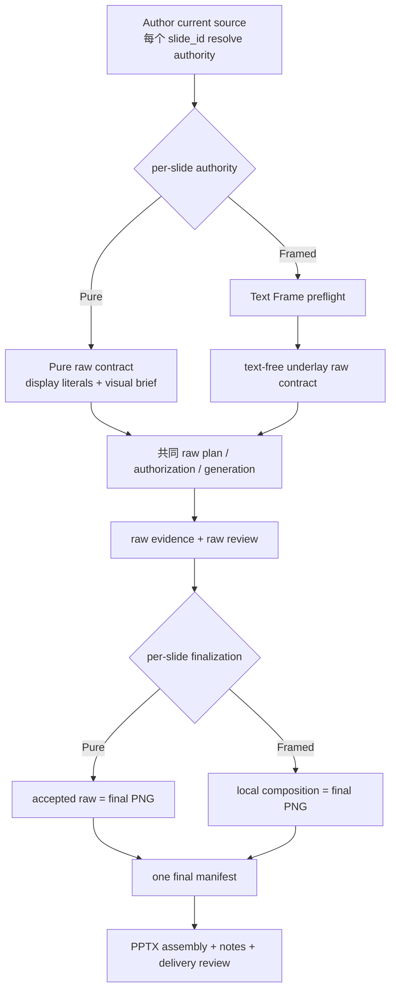
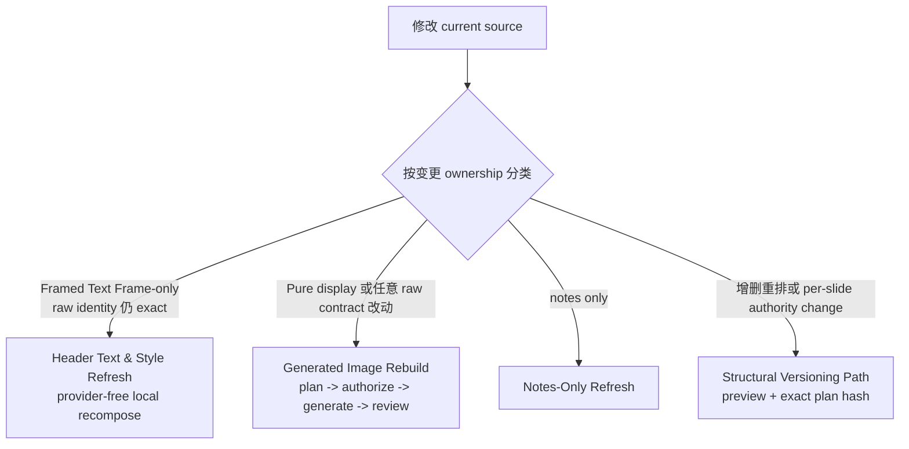
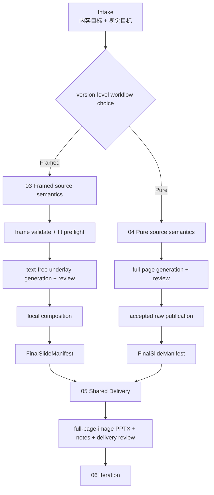

# Plan: Page Authority Workflow Baseline, Target, and Gap

> 类型: 分析 / 目标 / Gap | 更新: 2026-07-28 | 状态: 目标已对齐，待 OpenSpec change

## 阅读说明 / 本文自足边界

这份文档同时记录三件不能混在一起的事：

1. **CURRENT Baseline**：截至本文日期，accepted specs 与 runtime 实际如何工作；
2. **TARGET Model**：已经对齐、但尚未实施的 Framed / Pure 双工作流目标；
3. **IMPLEMENTATION GAP**：从 CURRENT 到 TARGET 必须修改什么、哪些不变量不能改变。

前半的 CURRENT 不是旧文档残留，也不能因为目标改变而删除。它是 migration、spec delta、
兼容策略和 regression test 的事实起点。后半的 TARGET 不是当前操作指南；在对应 OpenSpec
change 被接受并实施前，Agent 仍必须按 CURRENT runtime 与 accepted specs 工作。

本文独立回答五个问题：

1. 当前 deck 使用什么协议，Pure/Framed 现在如何选择？
2. 当前 source、raw evidence、final PNG、PPTX、notes 的完整 lineage 是什么？
3. 目标为什么要把 `03 Framed` 与 `04 Pure` 变成两条用户/Agent 工作流？
4. 哪些能力可以在下层共享，最终应在哪里合流？
5. 当前与目标之间的 gap 有多大，必须按什么顺序跨越？

详细 owner 与目录设计见
[`framed-image-directory-ssot.md`](framed-image-directory-ssot.md)。本文负责
Baseline/Target/Gap 总图；该文件负责目标目录、module、interface 和实施次序。两者必须
保持一致，但都不是 implementation authorization。

本文不读取或依赖任何 `deck_*`、`dpt_*`、`_generated/` 或历史 run bytes，也不授权修改
framework source、run bundle、state、receipt、journal 或生成物。

## 一页结论

| 维度 | CURRENT Baseline | TARGET Model | Gap 判断 |
| --- | --- | --- | --- |
| 用户选择 | 每个 slide 可选 Pure/Framed，同 deck 可混用 | 一个 deck version 只选择一次 Framed 或 Pure | 大：source/spec 语义变化 |
| production identity | `page-authority-image2-v1` + CURRENT receipt semantics | 可机械区分的新 marker/source receipt identity | 大：必须 version-separate，禁止原地改义 |
| 上层流程 | 一个 Page Authority lifecycle 内逐页 dispatch | `03 Framed` 与 `04 Pure` 是互斥 sibling workflows | 大：workflow/controller 重构 |
| Framed owner | 分散在 `01`、`02`、`04` | `03-framed-image` 完整负责到 final manifest | 大：业务规则迁移与去重 |
| Pure owner | 隐含在 `04-image-production` shared coordinator 内 | `04-pure-image` 完整负责到 final manifest | 中到大：显式 owner 与 adapter |
| raw 能力 | `04` 同时拥有 raw 与 authority branches | typed `RawWorkPlan` 下方可共享 authorization/evidence/review | 中：提取稳定 seam |
| 最终合流 | `04` 内 per-slide finalize 后继续 PPTX/notes | 两条流程先各自产出同 schema `FinalSlideManifest`，再合流 | 中：建立统一 artifact interface |
| delivery | `04` 同时负责 final/PPTX/notes/delivery | 独立 `05-delivery`，对 authority 无行为分支 | 中：迁移 owner |
| iteration | `05-iteration` 按逐页 authority 分类 | `06-iteration` 先按 version workflow 路由 | 中：编号与路由变化 |
| 现有 mixed runs | current、合法、可继续生产 | active new authoring 不再 mixed | 大且高风险：必须有兼容/迁移决策 |

结论：这不是“补一个 `03` 目录”或移动几个文件。它保留一条 shared integrity spine，但
改变上层产品工作流、source selection 粒度和 module ownership，必须先走 OpenSpec。

## Part I - CURRENT Baseline

### Current Authority

截至 2026-07-28，框架只有一个 current deck production protocol：

- source marker：`page-authority-image2-v1`；
- state mode：`image2-page-authority`；
- production adapter：`page-authority-image2`。

`pure-image2` 与 `framed-image2` **目前不是两条 deck workflow**。它们是同一 current
protocol 中每个 stable `slide_id` 的 final-pixel authority，一个 deck 可以混用。

CURRENT 的权威依据是：

- [Workflow overview](../../PPTMAKER_FRAMEWORK/workflow/README.md) 与
  [Agent Contract](../../PPTMAKER_FRAMEWORK/charter/AGENT_CONTRACT.md)；
- [content-parsing spec](../../openspec/specs/content-parsing/spec.md) 的 per-slide authority
  requirement；
- [pipeline-orchestration spec](../../openspec/specs/pipeline-orchestration/spec.md) 的 mixed
  deck single-lineage requirement；
- [Page Authority source parser](../../PPTMAKER_FRAMEWORK/scripts/01-content/internal/page_authority_source.mjs)；
- [raw profiles](../../PPTMAKER_FRAMEWORK/scripts/04-image-production/page-authority/raw_profiles.mjs)
  与 [raw compilation](../../PPTMAKER_FRAMEWORK/scripts/04-image-production/page-authority/raw_compilation.mjs)；
- [finalizer](../../PPTMAKER_FRAMEWORK/scripts/04-image-production/page-authority/finalizer.mjs)、
  [Framed runtime](../../PPTMAKER_FRAMEWORK/scripts/04-image-production/page-authority/internal/framed_runtime.mjs)
  与 [PPTX assembly](../../PPTMAKER_FRAMEWORK/scripts/04-image-production/page-authority/pptx_assembly.mjs)。

### Current Terminology

| 层级 | CURRENT 名称 | 含义 |
| --- | --- | --- |
| 工作上下文 | run-bundle production / framework maintenance | 前者生产具体 deck；后者修改 framework/specs/tests。 |
| 当前生产协议 | `page-authority-image2-v1` / `image2-page-authority` | 唯一 current protocol/state mode。 |
| 单页像素归属 | `pure-image2` / `framed-image2` | 每页 final pixels 的 owner；当前可混用。 |
| 历史边界 | legacy observer / adoption | read-only historical route，不是 current production adapter。 |

在 CURRENT 中，把 Pure/Framed 称为“两条用户工作流”是不准确的；在 TARGET 中，这个
说法会成为新的产品模型。阅读时必须看清段落标签。

### Current Source-To-Delivery Map

```text
用户内容与视觉方向
  -> <run-dir>/slide-specifications.md
  -> source default + 每个 stable slide_id 的可选 authority override
  -> current Page Authority source receipt
  -> per-slide raw contract
  -> raw plan / exact provider authorization（仅 nonzero submission）
  -> raw PNG + raw manifest + raw review = proceed
  -> per-slide finalization dispatch
       Pure: accepted raw PNG byte-for-byte pass-through
       Framed: accepted text-free underlay + local Text Frame composition
  -> one final manifest
  -> full-page-image PPTX
  -> speaker notes receipt
  -> delivery review
```

source 的共享显示字段是 `KICKER`、`TITLE`、`SUBTITLE`、`CALLOUT`，每页都要有 closed
`VISUAL BRIEF`。CURRENT parser 先解析 authority，再按 authority 执行不同语义约束。

### Current Pure And Framed Semantics

Page Authority 当前回答的问题是：**这一页最终可见的每个像素由谁负责？**

| Authority | Image2 责任 | 本地 runtime 责任 | CURRENT 适用条件 |
| --- | --- | --- | --- |
| `pure-image2` | 生成完整最终页面，包含语义性显示文字 | 无本地页面合成 | body labels、values、quotation、caption、timeline date、diagram/table/chart text 本身承载意义。 |
| `framed-image2` | 生成无文字 full-canvas underlay | 固定 `standard-v1` Text Frame 生成 kicker、title、subtitle、callout 的最终像素 | body 不承担文字语义，并需要稳定、可本地刷新的标题类文字。 |

Framed Text Frame 不是通用页面 renderer：

- 不接收任意 CSS、markup、坐标、字体或颜色 override；
- `title` 必填，所有字段必须先通过 deterministic fit preflight；
- raw contract 必须包含 `no-readable-text` 与 `no-labels`；
- Text Frame literals 不得进入 provider payload；
- accepted underlay 不能被 local compositor 任意改画，只能叠加固定 Text Frame。

Pure 也不是“没有文字”。Pure display fields 属于 Image2 raw contract，所以文字改变会使
raw contract 失效。

### Current Initial Production Workflow



两种 authority 当前共享 source receipt、raw planning、authorization、raw evidence、raw
review、final manifest、PPTX 和 notes lineage。Framed 不是“不使用 Image2”；它使用
Image2 生成 underlay，只把 Text Frame pixels 留给 deterministic local runtime。

### Current Final Artifact

两种 authority 最后都会变成 2000x1125 final PNG，再以 full-page image 写入 PPTX。
Framed 的本地文字因此仍是 rasterized pixels，不是 PowerPoint native editable text。
Speaker notes 独立来自 source，在 PPTX assembly 后由 notes owner 注入。

### Current Iteration Workflow



CURRENT 的 refresh consequences：

- Framed Text Frame-only change 可以在 exact accepted raw evidence 上本地重做 final、PPTX
  和 notes，不调用 provider；
- Pure display text 或任何 visual/raw-contract change 需要 fresh raw evidence 与 review；
- notes-only 不重做 pixels；
- 增删重排或 Pure/Framed authority change 走 structural versioning；apply 本身零远端调用。

### Current Invariants That Remain Authoritative

- `slide_id` 是跨版本 identity；`position` 只属于 current snapshot。
- `_generated/`、state、receipt、journal 不手改，只能通过 owning interface 重建或推进。
- nonzero raw provider submission 需要 exact current authorization。
- raw review `proceed` 是 finalization 前置；delivery review 是交付完成前置。
- raw reuse 绑定完整 tuple，不以 ID、文件名或 copied bytes 猜测 freshness。
- final PNG/PPTX/notes 必须保持可归因的 receipt lineage。
- 任何 TARGET 设计在落地前都不能放松这些 identity、authorization、integrity 与 recovery
  hard stops。

## Part II - TARGET Model

### Target Product Decision

TARGET 将 Pure/Framed 从“同一 lifecycle 内的 per-slide authority branch”提升为两条面向
用户与 Agent 的完整 sibling workflows：

- `03-framed-image`：完整 Framed workflow；
- `04-pure-image`：完整 Pure Image workflow；
- 一个新 deck version 在 intake/source authoring 时只选择一次；
- 所有 slides 继承 version workflow；active authoring 不提供 per-slide override；
- 如果 Framed 无法表达语义性 body text，Agent 必须引导用户重写内容或明确切换整个
  version，不能私下把单页改成 Pure。

“两条 workflow”不自动等于“两套 state protocol”。TARGET 可以继续共享底层
Page Authority integrity contracts，但不能复用 CURRENT production identity 后原地改变语义。
New source marker 与 source receipt schema 必须可机械区分；state mode 可以换名，也可以在
new source/state pair 中复用底层概念，但最终 pair 必须由 OpenSpec change 锁定且无歧义。

CURRENT identifiers 保留 CURRENT 含义：

- `page-authority-image2-v1` 继续表示 per-slide Pure/Framed authority；
- `pure-image2` / `framed-image2` 继续是 CURRENT per-slide tokens；
- TARGET workflow IDs 的确切名称待定，不得让同一 source/state bytes 在两个模型间重解释；
- CURRENT evidence 默认不能满足 TARGET；只有 accepted migration spec 证明 exact tuple 时，
  才能执行 plan-bound materialization。

### Target User-To-Delivery Map



对用户来说，两条路线从选择后都是直线。`03` 不先进入 `04` 再回到 `03`；`04` 也不再
作为包含 Framed 的 generic upper-level coordinator。Root workflow 必须表达
`03 XOR 04 -> 05 -> 06`，而不是按目录编号暗示 `03 -> 04`。

`01-content` 与 `02-visual-system` 仍是两条 workflow 共用的 method modules。所谓完整
Framed/Pure workflow，是用户只看见一条 end-to-end route；implementation 通过 `01`/`02`
interfaces 取得 shared grammar、stable identity、visual language 与 references，不复制这些
规则，也不把 Framed/Pure-specific semantics 放回 shared modules。

### Target Internal Sharing

上层工作流分离后，底层仍可共享稳定机制：

```text
03 Framed adapter ──> RawWorkPlan ──┐
                                    ├─> shared raw mechanics
04 Pure adapter   ──> RawWorkPlan ──┘    authorization / submit / evidence / review
                                                |
                                                v
                                       AcceptedRawEvidence
                                          /           \
                               03 compose          04 publish
                                          \           /
                                           FinalSlideManifest
                                                    |
                                                    v
                                      05 PPTX + notes delivery
```

共享 seam 的判断标准：

- 需要理解 `standard-v1`、frame literals、reserved rectangles、no-text 或 local capture
  的逻辑属于 `03`；
- 需要理解 Pure display literals、full-page raw contract 或 Pure rebuild 的逻辑属于 `04`；
- 只处理 provider scope、opaque contract digest、raw bytes、accepted evidence 的机制可以
  位于 shared raw owner；
- 只处理 bound final PNG、manifest、PPTX image placement、notes 和 delivery receipt 的
  机制属于 `05-delivery`；
- shared module 不得通过 `if (authority === ...)` 重新成为隐藏业务 owner。

两个 adapter 意味着这里存在真实 seam。复用的价值不是减少代码行，而是让 authorization、
evidence integrity 和 delivery lineage 继续只有一个 owner；workflow-specific implementation
可以显式分开，即使存在少量重复。

### Target SSOT

| Fact | TARGET Source of Record / owner |
| --- | --- |
| version 选择 Framed 或 Pure | canonical source frontmatter + resolved source receipt |
| Framed contract/preflight/underlay/composition | `03-framed-image` adapter 与其 typed evidence |
| Pure display/raw-to-final/rebuild | `04-pure-image` adapter 与其 typed plan |
| raw authorization/evidence/review | shared raw owner |
| 两条 workflow 的共同终点 | one schema `FinalSlideManifest` + bound final PNG bytes |
| PPTX/notes/final projection/delivery review | `05-delivery` receipt chain |
| 后续 change routing | `06-iteration`，读取 version workflow 与 direct evidence |

目录是 discovery/ownership SSOT；source、receipt、evidence 与 manifest 是 runtime Source of
Record。两者不能互相替代。

### Target Iteration

- Framed version 的 Text Frame-only change 仍走 provider-free local refresh；
- Framed underlay/visual change 仍回到 raw generation/review；
- Pure version 的 display/visual change 仍走 Generated Image Rebuild；
- notes-only 仍只更新 notes/delivery evidence；
- 增删重排仍走 Structural Versioning Path；
- Framed/Pure workflow change 变成整个 version 的 structural decision，不再是普通
  per-slide override。

TARGET 改变的是选择粒度与工作流形状，不改变“按 owner 与 invalidation 选择最小合法路径”
的原则。

## Part III - IMPLEMENTATION GAP

### Gap Matrix

| Gap | CURRENT | TARGET | 所需工作 | 风险/规模 |
| --- | --- | --- | --- | --- |
| Accepted specs | 明确允许 per-slide mixed | version-level exclusive workflow | 修改 `content-parsing`、`pipeline-orchestration`、`image-generation`、`visual-config`、`framework-charter` 等 specs | 大 / 高 |
| Production identity | `page-authority-image2-v1` + CURRENT receipt schema | new versioned marker + distinguishable receipt identity | marker-first dispatch、schema versioning、禁止同 bytes 双重解释 | 大 / 最高 |
| Source grammar | `page_authority_default` + per-slide override | canonical version workflow，无 override | 锁定字段、schema/version、diagnostics 与 templates | 大 / 高 |
| Source receipt | 每页记录 authority | version receipt 记录一次 workflow，slides 继承 | 新 receipt identity、hash/invalidation 与 compatibility | 大 / 高 |
| User guidance | 要求 Agent 逐页选择 authority | intake 时只选择一次 | 重写 BOOTSTRAP、quick-start、glossary、workflow root、playbook | 中到大 |
| Framed owner | `01`/`02`/`04` 分散 | `03` 完整 owner | 移动 validator、preset、preflight、raw contribution、capture、refresh | 大 |
| Pure owner | branch 隐含在 `04` | `04-pure-image` 显式 adapter | 收拢 Pure raw contract、publication、rebuild semantics | 中 |
| Raw coordinator | 同时理解 authority branch | 消费 typed `RawWorkPlan` | 提取 shared mechanics，删除 semantic switch | 中到大 |
| Finalizer | generic `finalizePage` 内 Pure/Framed branch | 各 workflow 产出同 schema manifest | 分离 compose/publish，固定 artifact interface | 中 |
| Delivery | 位于 current `04` | 独立 `05-delivery` | 移动 final manifest、projection、PPTX、notes、delivery review | 中 |
| Iteration | current `05` 读 per-slide authority | `06` 读 version workflow | 路由、编号、docs、controller metadata 迁移 | 中 |
| Architecture/tests | phase adjacency 与 tests 按旧 owner | sibling adapters + shared seams | 更新 manifest、whitelist、imports、ownership/coherence tests | 大 |
| CLI/controller | 一个 Page Authority lifecycle | marker-first route 后进入一条 workflow | `node-specification` 锁定 controller consumption；若 producer surface 改变则由 `cli-surface` 锁定 receipts/diagnostics | 待定 / 高 |
| Existing mixed runs | current legal runs | 不属于 new active authoring | bounded compatibility 或 explicit structural migration | 大 / 最高 |

### What Does Not Need To Split

以下 CURRENT 机制与 TARGET 一致，应优先保留一个 owner，而不是复制两套：

- provider credential/transport 与 exact authorization gate；
- raw tuple identity、manifest、reuse classification 与 review evidence；
- final PNG dimension/hash validation；
- final manifest integrity；
- full-page-image PPTX assembly；
- source-owned speaker notes injection；
- delivery review identity；
- stable `slide_id`、snapshot-local `position` 与 structural exact-plan-hash discipline。

这些机制被共享不是为了 DRY，而是因为复制后会产生 competing truth paths。

### Required Design Gates

在任何 framework relocation 或 implementation 前，OpenSpec change 必须回答：

1. version-level workflow 的 canonical source 字段与 receipt schema 是什么？
2. TARGET 的 new source marker、receipt schema 与 source/state pair 如何保证与 CURRENT
   `page-authority-image2-v1` 机械区分？state mode 是否换名？
3. 现有 mixed current run 如何继续、冻结或 structural migrate？
4. 哪些 current raw/final/review evidence 在迁移后可验证 materialize？除 accepted plan-bound
   proof 外，所有 cross-protocol evidence 必须失效。
5. 外部 CLI 保持现名并依据 receipt route，还是暴露新的 Framed/Pure commands？
6. `RawWorkPlan`、`AcceptedRawEvidence`、`FinalSlideManifest` 的 owner、writer、readers、
   hash binding 和 invalidation 是什么？
7. `03`/`04` 如何做到互不 import，只通过 approved shared interfaces 协作？
8. 哪些 negative tests 证明不存在 silent per-slide fallback、wrong-owner mutation 或第二份
   delivery truth？
9. `Header Text & Style Refresh` 的 TARGET surface 是 text-only，还是包含 versioned preset
   changes？`03` 必须给出唯一、可测试的语义。

### Transition Order

```text
confirm Baseline/Target/Gap
  -> create OpenSpec proposal/design/specs/tasks
  -> lock new production identity + source/receipt + mixed-run migration
  -> lock RawWorkPlan / AcceptedRawEvidence / FinalSlideManifest interfaces
  -> write two user-facing workflow documents
  -> establish 03 Framed and 04 Pure adapters
  -> extract shared raw mechanics and 05 Delivery
  -> migrate 06 Iteration, controller metadata, architecture contracts and tests
  -> handle current mixed runs through the accepted route
  -> remove old branches/paths
  -> full regression validation
```

不得先移动文件再补 spec，也不得用 compatibility re-export 长期维持两个 owner。

### Gap Completion Criteria

Gap 只有在以下事实都成立时才算关闭：

- new version source/receipt 恰好选择一个 workflow；
- TARGET marker/source/state/receipt identity 与 CURRENT pair 可机械区分，同一 bytes 不会被
  两种 parser/controller route 接受；
- root guidance 与 controller 明确执行 `03 XOR 04 -> 05 -> 06`；
- `03` 与 `04` 分别通过自己的 interface 产出同 schema `FinalSlideManifest`；
- `03` 与 `04` 不互相 import，shared code 不拥有 authority semantic branch；
- `05-delivery` 对两种 manifest 使用同一 PPTX/notes/delivery implementation；
- current mixed runs 有已接受、可测试、无猜测的 compatibility/migration route；
- authorization、raw review、final bytes、notes、delivery 和 structural identity invariants
  全部保持或被更严格地证明；
- old validators、branches、paths 与 misleading docs 被删除，不存在第二份 SSOT。

## 风险 / 取舍

- **把 TARGET 当 CURRENT。** 在 OpenSpec change 落地前，所有生产 Agent 仍按 Part I 执行；
  docs 与 diagnostics 必须有明确版本标签。
- **复用 CURRENT identifier 却改变语义。** CURRENT marker 与 authority tokens 永久保留
  Part I 含义；TARGET 必须使用 new versioned identity，并由 controller marker-first route。
- **为上层清晰复制底层 integrity。** 两条 workflow 可以有独立 implementation，但不能
  复制 authorization、evidence 或 delivery truth。
- **shared module 吞回业务差异。** 一旦 shared implementation 理解 frame/no-text/display
  semantics，就说明 seam 放错了，应把逻辑退回 adapter。
- **版本级 Framed 与内容冲突。** 应在 provider work 前给出单一 next action：重写为
  Framed-compatible content，或明确切换整个 version；不得暗中 mixed。
- **旧 mixed run 成为永久第三条 active workflow。** Compatibility 必须 bounded、可识别、
  有 removal/migration 方向，不能重新污染新 authoring。
- **编号误导。** `03` 与 `04` 是 sibling workflows；root graph、controller metadata 和
  architecture tests 都必须表达 XOR，而不是靠读者记住例外。

## 与 Policies 的关系

TARGET 与 gap closure 必须遵守 `openspec/policies`：

- 用户只面对一次 workflow choice，之后每个失败只有一个 nearest legal action；
- canonical source/receipt/evidence/manifest 是 direct facts，Markdown 不是 pass/fail authority；
- 同一事实在 inspect、preflight、gate、submit、refresh 中复用 owner evaluator；
- shared control 只有在减少 authority translation、duplicate validator 或 user-operated step
  时才成立；
- identity、authorization、bytes、hashes、provenance 与 recoverability 继续 hard-stop，
  不增加隐式 fallback 或 waiver。

## 落地关联

本文与
[`framed-image-directory-ssot.md`](framed-image-directory-ssot.md)
共同构成下一步 OpenSpec change 的输入：

- 本文固定 CURRENT、TARGET 和 gap；
- SSOT 计划固定目标 owner、interfaces、目录树与落地顺序；
- OpenSpec proposal/design/specs/tasks 才能授权和约束后续 framework implementation。
