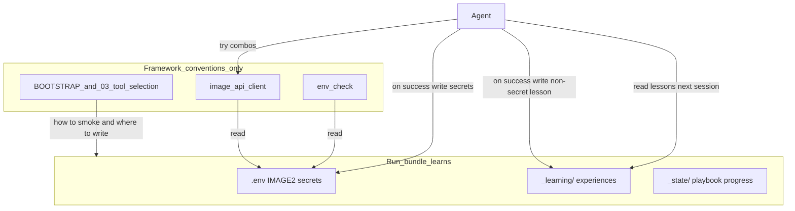

## Context

Agentic PPT workflow：Framework 定法，**每个 run bundle 自己积累可复用的操作经验**。今日缺口：

| 层 | 应有 | 今日 |
|----|------|------|
| 凭据 | `IMAGE2_*` 清晰、doctor=运行时 | OPENAI 名含糊；URL「可选」假象 |
| Client | submit/poll/result 同包络 | BUG-008 submit 漏 `data[]` |
| 试错 | MD 赋能多组合冒烟 | 一次失败易甩给小白 |
| 记忆 | bundle 内固定学习面 | 无约定 → 乱塞或只留在聊天 |

## Goals / Non-Goals

**Goals**

1. Image2 凭据契约 + doctor 对齐  
2. BUG-008  
3. Framework：**约定**冒烟规程 + **`_learning/` 自学习面**  
4. Run bundle：试通后 **自己**写入 `.env` + `_learning/…`（Framework 不代写内容模板以外的「记忆」）  
5. 分层一致：`.env` ≠ `_learning/` ≠ `_state/`  

**Non-Goals**

- Framework 侧跨项目记忆库  
- 删别名 / 改 API 路径  
- 密钥进 `_learning/` 或 markdown  
- 试通后自动写 `.env` / `_learning/` 的代码（本 change 只定 Agent/MD 规程）  

## Architecture（和谐分层）



## Decisions

### D0 — 分工铁律（宪法语气）

- **Framework**：约定目录、文件角色、禁止项、冒烟步骤。不保存某个用户的 endpoint 经验。  
- **Run bundle**：通过 Agent 把**本项目**试出来的经验写入约定位置；下次 session **先读 `_learning/` 再猜**。  
- **`.env`**：只放密钥与生效 URL（机器加载）。  
- **`_learning/`**：只放非密钥操作经验（人/Agent 可读）。  
- **`_state/`**：只放 playbook 进度；**不是**学习笔记筐。  

### D1 — Image2 规范名

```bash
IMAGE2_API_KEY=...
IMAGE2_BASE_URL=https://…/v1
# IMAGE2_BASE_URLS=…   # 可选；非空可代替单条 BASE_URL
```

别名 OPENAI_* / APIMART_* 仍解析；优先级 IMAGE2 → OPENAI → APIMART；CLI `--base-url` 最高。

### D2 — Resolve / bridge

`resolveApiKey` / `resolveBaseUrls` 直接读三套名。`bridgeCredentials` 填空 `APIMART_*`。`unified_pipeline` 去掉重复 bridge。

### D3 — doctor ≡ 运行时

缺 key 或缺 URL → **fail**。禁止「默认 endpoint」话术。

### D4 — `.env.example`

= D1。`_writeIfAbsent`。

### D5 — `_learning/` 宪法落点（必须**指定这件事儿**）

**唯一职责（一事一义，凡出现 `_learning/` 的地方都要写清，禁止空目录名）：**

> 本 run bundle 在**操作中试出来**、下次还能复用的**非密钥**经验。  
> Agent / 人下次进 deck：**先读这里再猜**，禁止只把经验留在聊天里。

**明确不是：** playbook 进度（→`_state/`）、密钥与生效凭据（→`.env`）、上游素材、`_generated/` 产物。

| 项 | 约定 |
|----|------|
| 路径 | `deck_*/_learning/`（deck 根，与 `_state/` 并列） |
| README 种子 | **必须**仿 `_state/README` 口径，至少含：`**这里放什么:**`（上段唯一职责）、`**不放什么:**`、`**谁读写:**` Agent、`**约定文件:** image2-proven.yaml`（Image2 冒烟试通回执）、禁止密钥。文案由 Framework 常量种子（如 `bundle_layout` 内 `LEARNING_DIR_README`），init 写入；不得只建空目录；**禁止**在永久 README 里写「本 change」这类过程话 |
| 树 / 文案 | `renderTree`、CONSTITUTION 树注释、deck 根 README 列表——凡点名 `_learning/`，旁注必须点出「操作经验 / 非密钥 / 非进度」，禁止只写目录名 |
| check | structure **允许**该目录；旧 deck 缺目录不因缺而 fail（与 `_state` 缺席策略同族）；`selfCheck`：`renderTree` 若漏 `_learning` 则 fail |
| Image2 回执 | `_learning/image2-proven.yaml`：`proven_at`、`base_url`、`via`（`env`\|`cli`\|`alias`\|`user-provided`）、可选 `notes`；**无 key 字段** |
| 扩展 | 同目录可增其它经验文件，但每个文件仍须能扫读出「记的是哪件操作经验」；仍禁密钥 |
| 落点禁区 | 禁止把学习笔记塞进 `_state/`、`_generated/`、聊天-only、或自创 `notes/`/`tmp/` |

### D6 — BUG-008

`unwrapDataRecord`；submit 认 `data[0].task_id`；poll 认 unwrapped status；result 可走同一 unwrap。单测数组 + 对象回归。

### D7 — 冒烟赋能（Framework MD only）

SSOT = `03-tool-selection.md`；BOOTSTRAP 链过来：

1. 缺凭据 → 问用户要候选  
2. 多组合试（规范名→别名→URL 列表→`--base-url`）  
3. 廉价冒烟：`style-master … --force --resolution 1k`  
4. 首败换组合；禁止首败结案「你自己配」  
5. 通了 → D8  

下次进 deck：Agent **先读 `_learning/image2-proven.yaml`（若有）** 再决定先试哪个 base。

### D8 — 试通写入（bundle 自己学；MD/Agent 行为，本 change 不写自动 persist 代码）

| 写什么 | 谁写 | 写哪 | 指定的事儿 |
|--------|------|------|------------|
| 生效 `IMAGE2_*` | Agent | `.env`（优先 deck 根） | 密钥 / 机器加载 |
| 非密钥回执 | Agent | `_learning/image2-proven.yaml` | **操作经验**（`_learning/` 唯一职责下的约定文件） |

禁止：密钥进 `_learning/`；经验只留聊天；自创 `notes/`、`tmp/` 等非宪法目录装学习内容。

### D9 — 文档 / 代码触点

凡点名 `_learning/`：CONSTITUTION（职责句 + 树旁注）、`LEARNING_DIR_README`、deck README、BOOTSTRAP、03-tool-selection——**同一句职责**，禁止裸目录名。另：00-zero-to-ready；02-nodejs；AGENTS；根 README；client/pipeline；`_state` README 保留进度语义，并加一句「操作经验见 `_learning/`（非密钥经验面）」。

### D10 — Spec

- `framework-charter`：CONSTITUTION `_learning/` **带目的句**  
- `run-bundle-management`：init README / 树旁注 / selfCheck / legacy  
- `environment-check` / `image-generation` / `style-master-generation`  

### D11 — Acceptance

1. 新 bundle `_learning/README.md` 含「这里放什么」级目的句；树与 deck README 旁注可见  
2. `.env.example` = IMAGE2_*；无 URL → doctor fail  
3. 数组 submit → task_id；别名 resolve 绿  
4. SSOT/BOOTSTRAP/CONSTITUTION：冒烟 + `.env`（密钥）+ `_learning/`（操作经验）分工正确且**写明职责**  
5. BUG-008 归档；`npm test` 绿  

## Risks

| 风险 | 缓解 |
|------|------|
| `_learning` 被当成又一个 `_state` | D5 唯一职责；README「不放什么」；禁止写进进度段 |
| 只建空目录、没人知道干什么 | README/树/CONSTITUTION **强制目的句**；验收查「这里放什么」 |
| 密钥误写入 learning | D8 禁止；spec 场景钉死 |
| check 拒收新目录 | bundle_layout 显式允许 |

## Migration

旧 deck：首次需要学习面时补种 `_learning/` + 带目的句的 README（与 init 同文案）。别名 `.env` 仍可用直至改写 IMAGE2_*。

## Open Questions

_无（D0–D11 已关闭；persist 为 Agent/MD，非自动代码；`via` 枚举见 D5）。_
