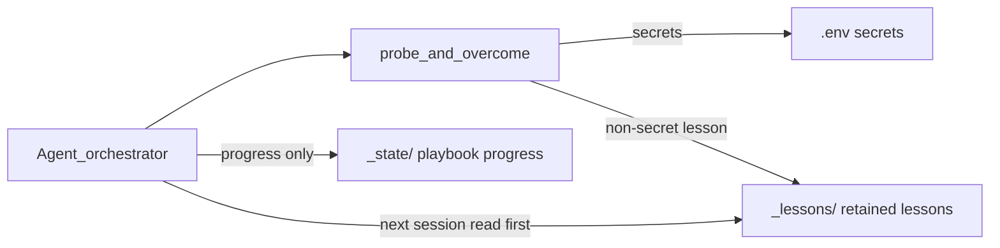

## Context

Agent 是编排器：自我琢磨、试探、**自己克服**、修复。修好不落盘 → 下一 session 失忆。

今日：`_learning/` 名偏软；README 以 Image2 为主角；宪法缺「遇事自己做、做完留下」的硬强调。

**已锁死：目录名 = `_lessons/`。** 无第二答案。

## Goals / Non-Goals

**Goals**

1. 路径唯一：`deck_*/_lessons/`（替换 `_learning/`）
2. CONSTITUTION **独立小节**钉死 agentic 闭环
3. README：闭环 + 泛化 + 写规矩；例子非清单
4. Image2 落点改为 `_lessons/image2-proven.yaml`，服从通用规矩
5. Framework 常量 SSOT；deck 迁移对齐

**Non-Goals**

- `_issues/`；自动写条目代码；改凭据契约；跨 deck 全局记忆库；保留 `_learning/` 别名目录

## Architecture



## Decisions

### D-name — `_lessons/`（已关闭 · 唯一）

| 项 | 值 |
|----|-----|
| 路径 | `deck_*/_lessons/` |
| 常量 | `LESSONS_DIR = '_lessons'`；`LESSONS_DIR_README`；`LESSONS_IMAGE2_PROVEN = 'image2-proven.yaml'`（文件名保留） |
| 删除 | `LEARNING_DIR` / `LEARNING_DIR_README` / `LEARNING_IMAGE2_PROVEN` |
| 迁移 | 有 `_learning/` 的 deck：`mv` → `_lessons/`；覆盖 README 种子 |
| 结构 check | 允许 `_lessons/`；缺席不单独 fail；**不**再把 `_learning/` 当规范名（旧空目录若残留可忽略或人工删） |

### D0 — Agentic 闭环（宪法 · 不可降级）

```
遇事 → 自我琢磨/试探 → 自己克服 → 留下非密钥教训到 _lessons/ → 下次先读再猜
```

修好只留聊天 = **违反闭环**。  
CONSTITUTION **独立小节**（标题约「Run bundle 自留教训面 `_lessons/`」）；README 复述同一闭环。

### D1 — `LESSONS_DIR_README` 结构

1. **这里放什么** — 克服困难后可复用的非密钥教训；先读再猜  
2. **闭环** — 试通/修好必须留下，禁止聊天-only  
3. **不放什么** — `.env` / `_state` / 素材 / `_generated` / 无复用吐槽  
4. **谁读写** — Agent + 维护者；Framework 只定规矩  
5. **怎么写** — D2  
6. **打个比方** — 配通出图、某页排版踩坑（非清单）  
7. **禁止密钥**

### D2 — 写条目规矩

| 规矩 | 要求 |
|------|------|
| 一题一文 | 一经验一文件（`.md` / `.yaml`） |
| 文件名 | `kebab-case`+主题；禁 `notes.md`/`tmp.md` |
| 四问 | 遇到什么 / 怎么试的 / 结论 / 下次先看哪 |
| 无密钥 | 禁 key/token/密码 |
| 先读再猜 | 进 deck 或重踩前先扫 `_lessons/` |
| 修好就留 | 试通/自愈后写条目 |

### D3 — 树与 CONSTITUTION

树：`_lessons/` + 旁注（retained lessons / read-before-guess）；子项示意 `README.md` + `*.md|*.yaml`；**不**钉死唯一 `image2-proven.yaml`。

### D4 — Image2 SSOT

落点：`_lessons/image2-proven.yaml`；字段不变；服从 `_lessons/README` 规矩。

### D5 — 迁移清单

1. `bundle_layout` 常量/树/init/selfCheck  
2. CONSTITUTION / AGENTS / BOOTSTRAP / 03-tool-selection / template-deck-guide / state README 指针  
3. main/delta 口径；测试断言  
4. `deck_ai_sdlc_bpm_keynote`：`_learning`→`_lessons` + README  
5. archive sync 三 capability

## Risks

| 风险 | 缓解 |
|------|------|
| 旧文档残留 `_learning` | tasks 扫清；测试/selfCheck |
| 规矩太松/太紧 | D2；短 yaml 允许 |
| 与 Image2 文档打架 | D4 指回 README |

## Migration Plan

Apply 按 D5 顺序；structure-only 不因缺 `_lessons` 红；新 init 必有。

## Open Questions

_无（D-name = `_lessons/` 已锁死）。_
